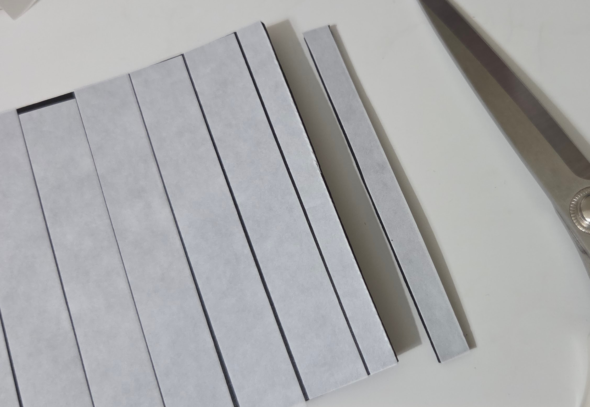
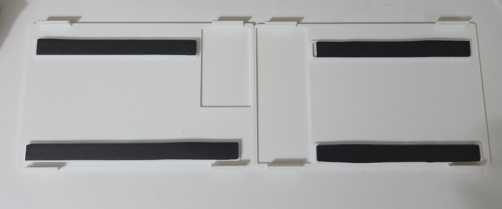
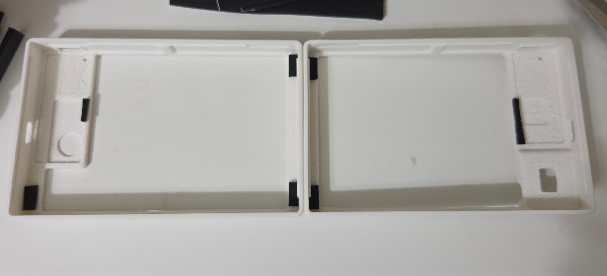
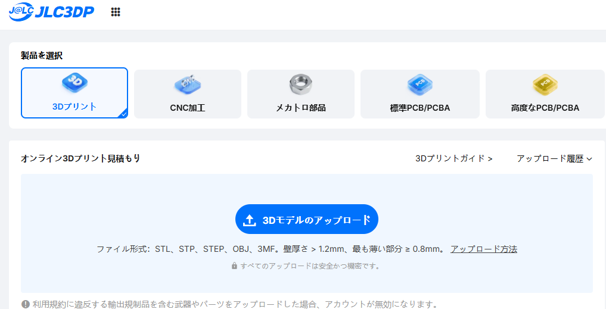
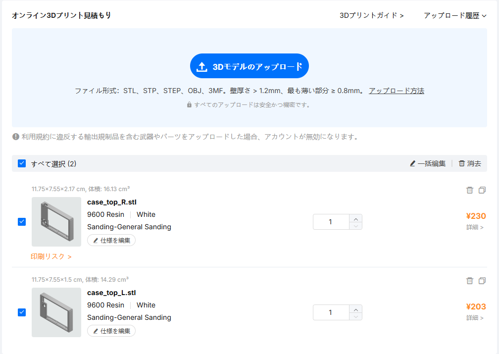
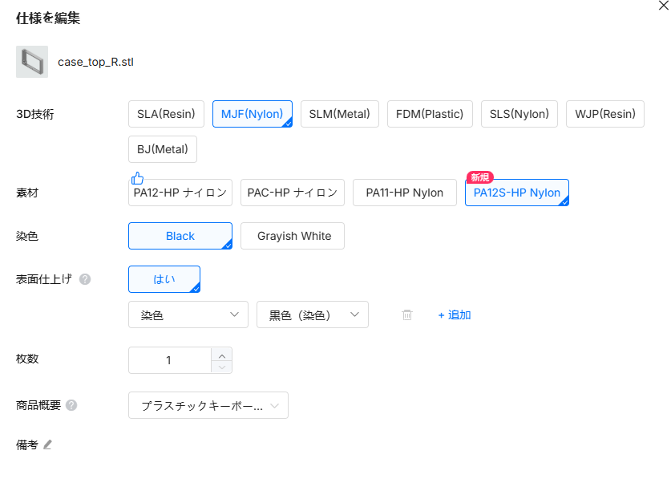
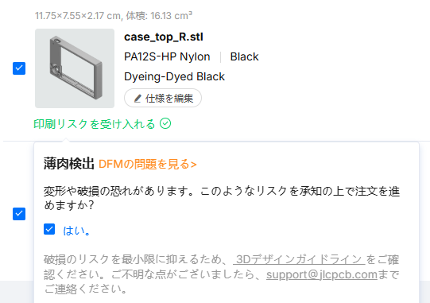

# FrostOrtho-3dprint-data
個人利用の範囲でしたら自由に使用・改変いただけます。  

## バージョン
- v1.2.0  
2026年6月22日以降に頒布しているケース。  
v1.2.0から基板や一部パーツが変更されたためv1.1.0以前と互換性なし。  

- v1.1.0  
2026年5月～6月中旬に頒布しているケース。  
v1.0.0から細かな改善をしたもの。  

- v1.0.0  
キーケット2026以前に頒布した際のケース。  
v1.1.0と互換性があるのでv1.1.0の使用をおすすめします。  

- V0  
試作段階のもの。  
電源スイッチが少し奥にあるため現行のケースとトップケースが少し異なるためv1.0.0以降と互換性がありません。  

## ケース作成
### v1.1.0 ～ v1.2.0
ケースを印刷/発注しただけでは使用できず、別途スポンジやマグネット等の取り付けが必要になります。

#### 必要なもの
| 部品名 | 説明 | 参考購入先 |
| -- | -- | -- |
| スポンジシート(3mm) | ボトムケースに敷くスポンジシート。ポロンスポンジがへたりにくくておすすめです。 | https://www.amazon.co.jp/dp/B00G468722?ref=ppx_yo2ov_dt_b_fed_asin_title&th=1 |
| スポンジシート(2mm) | トップケースに貼るスポンジシート。使いやすくてテープ状のものを使用していますが、2mmくらいの厚さであればなんでも。  透明ケースの場合は100均等にある透明の両面テープが見た目綺麗でおすすめです。 | https://www.amazon.co.jp/dp/B0DDJDYVHX?ref_=ppx_hzsearch_conn_dt_b_fed_asin_title_5&th=1 |
| マグネット(直径2mm × 厚さ1mm) | トラックボールケースとトップケースを着脱可能にするための磁石 | https://www.amazon.co.jp/dp/B0FXB1RH63?ref_=ppx_hzsearch_conn_dt_b_fed_asin_title_1&th=1 |
| ベアリング(外形4mm 内径1.5mm 幅2mm) | トラックボールのベアリング | https://www.amazon.co.jp/dp/B0836S5376?ref_=ppx_hzsearch_conn_dt_b_fed_asin_title_6&th=1 |
| ネジ(M1.4 × 4~5mm) | ベアリングを固定するねじ | https://www.amazon.co.jp/dp/B076ZCH1NJ?ref_=ppx_hzsearch_conn_dt_b_fed_asin_title_1 |

#### 取り付け方
- ボトムケース  
  3mmのスポンジシートを7.5mmくらいの幅にカットします。  
  片面に両面テープを貼ってから切ると貼り付けるのが楽です。  
   
凹みのある部分にスポンジシートを貼り付けます。  
   
- トップケース  
  2mmのスポンジシートを小さくカットして画像の位置に貼ってください。  
     

## 発注方法（JLC3DP）
[JLC3DP](https://jlc3dp.com/jp?spm=Jlc3dp.Homepage.1001)での発注方法について簡単に紹介します。UIは更新される可能性があります。

1. アカウント登録を済ませて発注画面へ

2. STLファイルをアップロード

3. 「使用を編集」をクリック
4. 好きな素材を選びます。以下ご参考ください。
   - クリア：SLA(Resin) > 8001レジン > 透明 > オイルスプレー仕上げ  
    表面を削った後にオイルスプレーするので品質にばらつきがあるものの、そのまま組み立てれて綺麗です。  
    ※ 素材の特性上歪んだ状態で届くことがあります。70~80度くらいのお湯で柔らかくして歪みを取ってください。
   - 半透明：SLA(Resin) > 8001レジン > 半透明 > 表面仕上げなし  
    結構バリがあるので自分でやすりがけ必須です。  
    やすりがけやコーティングが苦でなければ、こっちを綺麗に磨いてクリアケースにするのもいいかも。  
    ※ 素材の特性上歪んだ状態で届くことがあります。70~80度くらいのお湯で柔らかくして歪みを取ってください。
   - 黒：MJF(Nylon) > PA12S-HP Nylon > 黒色(染色)  
    PA12S-HPは質感がめちゃくちゃいいです。PA12-HPの方はざらつきが強いので注意。  
   - 例：
    
5. 印刷リスクが表示された場合は、内容を確認してチェックをつけてください。
   
6. すべてのパーツで素材を選択したら、「発注する」ボタンをクリック
7. 住所など必要な情報を入力して発注します。レビュー後の支払いになるので、この時点ではまだ支払いはしません。
8. レビュー結果がメールに届きます。  
9. トラボケースで指摘来ることが多いのですが、リスク許容するのでお願いします～て感じで返信してます。
10. すべてのレビューが完了し、Approvedとなったメールが届きます。
11. 発注履歴から支払いをすれば製作開始されます。
12. 製作途中で確認メールが届くことがあるので、届いたら都度対応します。
13. 「Your JLCPCB Order Is On Its Way To You」のメールが届いたらあとは届くのを待つだけです！