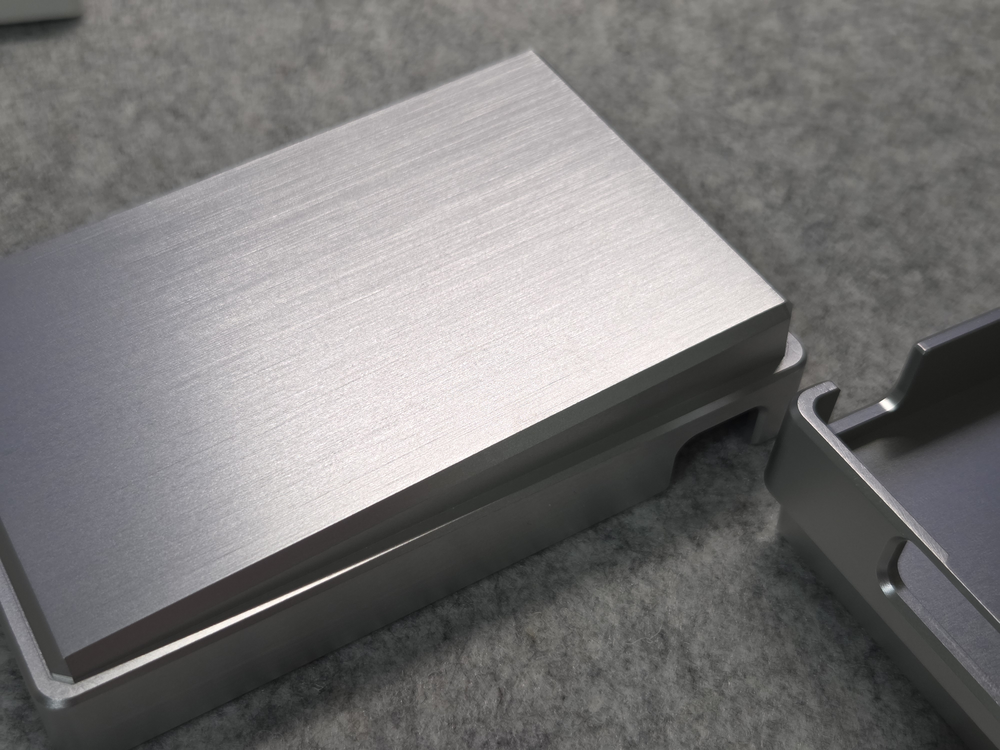
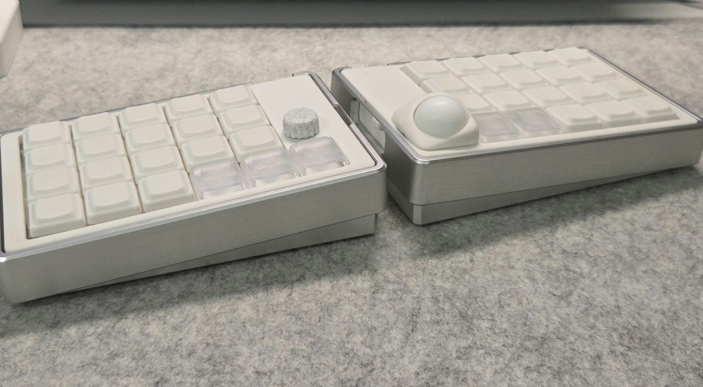

# FrostOrtho-3dprint-data
個人利用の範囲でしたら自由に使用・改変いただけます。

> [!WARNING]
> v1.3.0のセンサーモジュール固定パーツは現在データ修正中です。修正が完了するまで、プリント・発注はもう少しお待ちください。
  

> [!WARNING]
> 自宅のBambuLab a1miniでプリントする用に作成しているデータであるため、機種や素材、印刷方式によって寸法に差異が出て使用できない可能性があります。

## バージョン
ケースは頒布時期によって互換性があるため確認してください。  

- v1.3.0  
2026年11月以降に頒布しているケース。  
v1.2.0と互換性あり。  

- v1.2.0  
2026年6月22日以降に頒布しているケース。  
v1.2.0から基板や一部パーツが変更されたためv1.1.0以前と互換性なし。  

- v1.1.0  
2026年5月～6月中旬に頒布しているケース。  
v1.0.0から細かな改善をしたもの。  

- v1.0.0  
キーケット2026以前に頒布した際のケース。  
v1.1.0と互換性があるのでv1.1.0の使用をおすすめします。  

- V0  
試作段階のもの。  
電源スイッチが少し奥にあるため現行のケースとトップケースが少し異なるためv1.0.0以降と互換性がありません。  

## ケース作成（v1.1.0 ～ v1.2.0）
[こちら](https://github.com/imo00o/FrostOrtho-3dprint-data/tree/v1.2.0)  のケース作成（v1.1.0 ～ v1.2.0）をご確認ください。

## ケース作成（v1.3.0）
### プリント・発注が必要なもの
| 部品番号 | 部品名 | 数 | 3Dプリント用ファイル名 | 発注用ファイル名 |
| ---- | ---- | ---- | ---- | ---- |
| 1 | トップケース | 2（左右） | /case/v1.3.0/top.3mf | /case/v1.3.0/step/top_l.step, top_r.step |
| 2 | ボトムケース | 2（左右） | /case/v1.3.0/bottom.3mf | /case/v1.3.0/step/bottom_l.step, bottom_r.step |
| 3 | スイッチプレート | 2（左右） | /case/v1.3.0/plate.3mf | /case/v1.3.0/step/plate_l.step, plate_r.step |
| 4 | スイッチカバー | 2 | /case/v1.3.0/slide.3mf | - |
| 5 | リセットスティック | 2 | /case/v1.3.0/stick.3mf | - |
| 6 | ノブ | 1 | /case/v1.3.0/nob.3mf | /case/v1.3.0/step/nob.step |
| 7 | トラックボールカバー | 1 | /case/v1.3.0/torabo_case.3mf | /case/v1.3.0/step/torabo_case.stl |  
| 8 | センサーモジュール固定パーツ | 1 | /case/v1.3.0/sensor_case.3mf | /case/v1.3.0/step/sensor_case.step |
| 9 | キーキャップ(ノーマル) | 34 | /keycap/3mf/keycaps.3mf | /keycap/stl/keycap_nomal_mjf.stl |
| 10 | キーキャップ(ホーミング) | 2 | /keycap/3mf/keycaps.3mf | /keycap/stl/keycap_flat_mjf.stl |
| 11 | キーキャップ(コンベックス) | 5 | /keycap/3mf/keycaps.3mf | /keycap/stl/keycap_flat_mjf.stl |

> [!TIP]
> keycap_nomal_mjf.stl、keycap_flat_mjf.stl はMJF(PA12S-HP)でちょうどいいですが、8001レジン(半透明)では少し緩くクリアスプレーを吹くといい感じでした。ほかの素材は不明です。

> [!NOTE]
> スイッチカバー、リセットスティックはパーツが小さすぎるため連結する等しなければ発注できません（いつか連結したデータアップし、、ます、、いつか、、）

### 別途必要なもの
自作キット(ケースなし)をご購入いただいた方は以下パーツはキットに含まれています。
| 部品名 | 説明 | 参考購入先 |
| -- | -- | -- |
| スポンジシート(3mm) | ボトムケースに敷くスポンジシート。ポロンスポンジがへたりにくくておすすめです。 | https://www.amazon.co.jp/dp/B00G468722?ref=ppx_yo2ov_dt_b_fed_asin_title&th=1 |
| スポンジシート(1mm,2mm) | トップケースに貼るスポンジシート。シールタイプの厚さ1mm、2mmのものがおすすめ。  透明ケースの場合は100均等にある透明の両面テープが見た目綺麗でおすすめです。 | https://www.amazon.co.jp/dp/B0DDJDYVHX?ref_=ppx_hzsearch_conn_dt_b_fed_asin_title_5&th=1 |
| マグネット(直径2mm × 厚さ1mm) | トラックボールケースとトップケースを着脱可能にするための磁石 | https://www.amazon.co.jp/dp/B0FXB1RH63?ref_=ppx_hzsearch_conn_dt_b_fed_asin_title_1&th=1 |
| ベアリング(外形4mm 内径1.5mm 幅2mm) | トラックボールのベアリング | https://www.amazon.co.jp/dp/B0CV75YFQY?ref=ppx_yo2ov_dt_b_fed_asin_title&th=1 |
| ネジ(M1.4 × 4~5mm) | ベアリングを固定するねじ | https://www.amazon.co.jp/dp/B076ZCH1NJ?ref_=ppx_hzsearch_conn_dt_b_fed_asin_title_1 |

## 発注方法（JLC3DP）
[JLC3DP](https://jlc3dp.com/jp?spm=Jlc3dp.Homepage.1001)での発注方法について簡単に紹介します。UIは更新される可能性があります。  

1. アカウント登録を済ませて発注画面へ

2. STLファイルをアップロード

3. 「仕様を編集」をクリック
4. 好きな素材を選びます。以下ご参考ください。
   - クリア：SLA(Resin) > 8001レジン > 透明 > オイルスプレー仕上げ  
    表面を削った後にオイルスプレーするので品質にばらつきがあるものの、そのまま組み立てれて綺麗です。

     > **Note**  
     > 素材の特性上歪んだ状態で届くことがあります。70~80度くらいのお湯で柔らかくして歪みを取ってください。
   - 半透明：SLA(Resin) > 8001レジン > 半透明 > 表面仕上げなし  
    結構バリがあるので自分でやすりがけ必須です。  
    やすりがけやコーティングが苦でなければ、こっちを綺麗に磨いてクリアケースにするのもいいかも。

     > **Note**  
     > 素材の特性上歪んだ状態で届くことがあります。70~80度くらいのお湯で柔らかくして歪みを取ってください。
   - 黒：MJF(Nylon) > PA12S-HP Nylon > 黒色(染色)  
    PA12S-HPは質感がめちゃくちゃいいです。PA12-HPの方はざらつきが強いので注意。  
   - 例：
    
5. 印刷リスクが表示された場合は、内容を確認してチェックをつけてください。
   
6. すべてのパーツで素材を選択したら、「発注する」ボタンをクリック
7. 住所など必要な情報を入力して発注します。レビュー後の支払いになるので、この時点ではまだ支払いはしません。
8. レビュー結果がメールに届きます。  
9. トラボケースで指摘来ることが多いのですが、リスク許容するのでお願いします～て感じで返信してます。
10. すべてのレビューが完了し、Approvedとなったメールが届きます。
11. 発注履歴から支払いをすれば製作開始されます。
12. 製作途中で確認メールが届くことがあるので、届いたら都度対応します。
13. 「Your JLCPCB Order Is On Its Way To You」のメールが届いたらあとは届くのを待つだけです！

## アルミケース
プラスチックケースごと、上からすぽっとはめて使用するチルト用アルミケースです。  
チルト部分が結構重くなるので、質量のおかげで打鍵感・打鍵音がよくなる気がしてます。持ち運びには向いていません、とても重い。  

[アルミケースデータ](./aluminum-case/)  
チルトの角度変えたい場合はstepファイル修正してください。

### 発注
[JLCCNC](https://jlccnc.com/jp/cnc-machining-quote)で発注できます。JLC3DPの発注手順とほぼ同じです。  
これも薄すぎる部分があると指摘メールきますが、リスクを許容します～と返信しています。今のところ大丈夫だったことしかないですが、ちぎれたらすみません。。

表面仕上げなどなどお好みで指定してください。私が試したことあるのはこちら↓
- Bead blasting + Anodizing natural マット  
  サラサラした感じで少し白っぽい。傷がつきやすい気がしました。  
    
- Anodizing natural 光沢  
  ツルツルでしっかり光沢感があります。光沢の方がアルミっぽくて好きでした。  
  beadblastingかbrushingはした方がいいかも、気になるほどじゃないもののよく見たら傷があったりはしました。  
  
- Brushing+ Anodizing natural 光沢  
  Brushingは線状の表面処理がされています。個人的に一番好きです。
    
  

データアップロードして仕様を指定すると正確な価格出ますが、3万円くらい、、します、、
